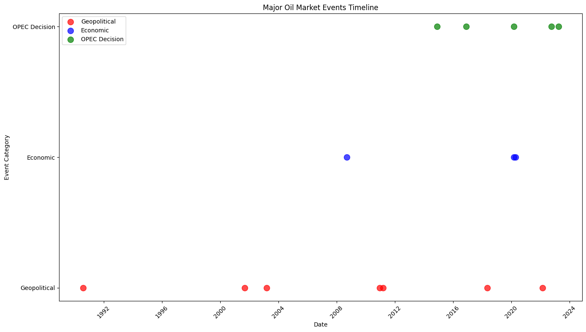
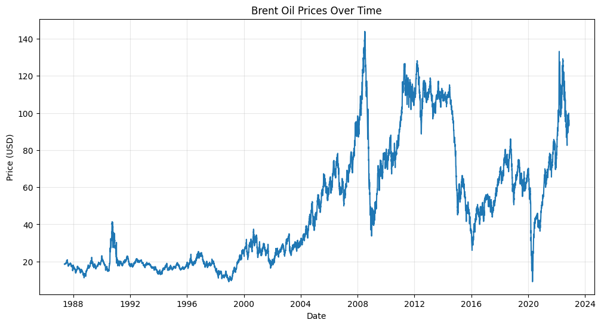

# Change Point Analysis and Statistical Modelling of Time Series Data

[](https://www.python.org/downloads/)
[](https://opensource.org/licenses/MIT)
[](https://github.com/username/Change-point-analysis-and-statistical-modelling-of-time-series-data/actions)
[](https://github.com/username/Change-point-analysis-and-statistical-modelling-of-time-series-data)

A comprehensive analysis framework for detecting structural breaks in Brent oil price data using change point detection methods and statistical modeling techniques.

## Project Overview

This project implements a complete workflow for analyzing Brent oil prices to identify change points that correspond to major geopolitical events, OPEC decisions, and economic shocks. The analysis distinguishes between statistical correlation and causal relationships.

## Features

- **Modular Architecture**: Clean, maintainable code with comprehensive error handling
- **Multiple Change Point Methods**: PELT, Binary Segmentation, and Sliding Window detection
- **Event Analysis**: 15+ major oil market events with structured data
- **Time Series Analysis**: Trend, stationarity, and volatility analysis
- **Interactive Notebooks**: Ready-to-run Jupyter notebooks for analysis

## Project Structure

```
📦 Change-point-analysis-and-statistical-modelling-of-time-series-data/
├── 📁 .github/
│   └── 📁 workflows/              # CI/CD automation
│       ├── ci.yml                 # Testing pipeline
│       ├── deploy.yml             # Documentation deployment
│       └── release.yml            # Release automation
├── 📁 data/                       # Data storage (immutable raw, processed)
│   ├── 📁 raw/
│   │   └── brent_oil_prices.csv   # Original oil price data
│   └── 📁 processed/
│       └── events.csv             # Compiled geopolitical events
├── 📁 notebooks/                  # Jupyter notebooks for exploration
│   ├── 01_data_workflow_analysis.ipynb    # Complete workflow demo
│   ├── 02_events_analysis.ipynb           # Events analysis
│   └── 03_change_point_comparison.ipynb   # Methods comparison
├── 📁 src/                        # Source code modules
│   ├── data_workflow.py          # Main workflow orchestrator
│   ├── event_compiler.py         # Geopolitical events compilation
│   ├── time_series_analyzer.py   # Time series properties analysis
│   └── change_point_model.py     # Change point detection models
├── 📁 scripts/                    # Automation scripts
│   └── run_analysis.py           # Automated analysis runner
├── 📁 tests/                      # Unit tests
│   └── test_workflow.py          # Test suite
├── 📁 results/                    # Generated files and results
│   ├── 📁 figures/               # Visualizations and plots
│   └── 📁 models/                # Saved model outputs
├── 📁 docs/                       # Project documentation
│   └── methodology.md            # Analysis methodology
├── 📄 main.py                    # Main execution script
├── 📄 Makefile                   # Workflow automation
├── 📄 requirements.txt           # Python dependencies
├── 📄 environment.yml            # Conda environment
├── 📄 setup.py                   # Package installation
├── 📄 .gitignore                 # Git ignore rules
└── 📄 README.md                  # Project documentation
```

## Installation & Setup

**Requirements**: Python 3.8+ (Python 3.9 recommended)

### Option 1: Using pip
```bash
# Clone the repository
git clone <repository-url>
cd Change-point-analysis-and-statistical-modelling-of-time-series-data

# Create virtual environment
python -m venv venv
source venv/bin/activate  # On Windows: venv\Scripts\activate

# Install dependencies
pip install -r requirements.txt
```

### Option 2: Using conda
```bash
# Clone the repository
git clone <repository-url>
cd Change-point-analysis-and-statistical-modelling-of-time-series-data

# Create conda environment
conda env create -f environment.yml
conda activate brent-oil-analysis
```

### Option 3: Development installation
```bash
# For development with editable install
pip install -e .
```

## Step-by-Step Replication Guide

### Prerequisites
- Python 3.8+ installed
- Git installed
- 2GB free disk space

### Complete Setup (5 minutes)

1. **Clone and Navigate**
   ```bash
   git clone <repository-url>
   cd Change-point-analysis-and-statistical-modelling-of-time-series-data
   ```

2. **Create Environment**
   ```bash
   python -m venv venv
   # Windows:
   venv\Scripts\activate
   # macOS/Linux:
   source venv/bin/activate
   ```

3. **Install Dependencies**
   ```bash
   pip install -r requirements.txt
   ```

4. **Verify Installation**
   ```bash
   python -c "import pandas, numpy, scipy; print('✓ Setup complete')"
   ```

5. **Run Analysis**
   ```bash
   python main.py
   ```

### Expected Results
- Console output with analysis summary
- `data/processed/events.csv` created
- `analysis.log` generated
- Results in `results/` directory

### Troubleshooting
- **Import errors**: Ensure virtual environment is activated
- **Permission errors**: Run with appropriate permissions
- **Missing data**: Check `data/raw/brent_oil_prices.csv` exists

## Usage

### Complete Analysis Pipeline
```bash
# Run the complete analysis (recommended for first-time users)
python main.py
```
**Expected output**: Analysis results in console, processed data in `data/processed/`, and log file `analysis.log`

### Interactive Analysis
```bash
# Launch Jupyter notebooks for step-by-step analysis
cd notebooks
jupyter notebook

# Start with: 01_data_workflow_analysis.ipynb
```

### Testing
```bash
# Run all tests
pytest tests/

# Run tests with coverage
pytest tests/ --cov=src --cov-report=html
```

### Automated Workflows
```bash
# Using Makefile (recommended)
make install    # Install dependencies
make data       # Process data
make analysis   # Run complete analysis
make test       # Run tests
make lint       # Check code style
make all        # Run everything

# Using scripts
python scripts/run_analysis.py
```

## Sample Input and Output

### Input Data Format

**Brent Oil Prices (`data/raw/brent_oil_prices.csv`)**:
```csv
Date,Price
1987-05-20,18.63
1987-05-21,18.45
1987-05-22,18.55
...
2022-11-14,92.61
```

**Compiled Events (`data/processed/events.csv`)**:
```csv
date,event,category,impact
1990-08-02,Iraq invasion of Kuwait,Geopolitical,High
2001-09-11,September 11 attacks,Geopolitical,High
2008-09-15,Lehman Brothers collapse,Economic,High
...
```

### Expected Output

**Console Output (from `python main.py`)**:
```
=== ANALYSIS SUMMARY ===
Events compiled: 15
Change points detected: 3
Key assumptions: 4
Identified limitations: 5

=== TIME SERIES PROPERTIES ===
Trend Analysis: {'trend_slope': 0.023, 'trend_significance': True}
Stationarity Test: {'is_stationary': False, 'p_value': 0.342}

=== CHANGE POINT DETECTION ===
Method: PELT
Change points detected: 3
Change dates: ['2008-09-15', '2014-11-27', '2020-03-06']
```

**Generated Files**:
- `analysis.log` - Detailed execution log
- `data/processed/events.csv` - Compiled events dataset
- Notebook outputs with visualizations and analysis results

### Sample Visualization

**Events Timeline**:



**Brent Oil Prices Over Time**


*Visualization of major oil market events categorized by type (Geopolitical, Economic, OPEC Decisions) plotted over time to show the relationship between events and potential market disruptions.*

## Key Components

### 1. Data Workflow (`src/data_workflow.py`)
- Orchestrates complete analysis pipeline
- Defines assumptions and limitations
- Handles correlation vs causation distinction

### 2. Event Compiler (`src/event_compiler.py`)
- Compiles 15+ major oil market events
- Categories: Geopolitical, Economic, OPEC Decisions
- Structured dataset with dates and impact levels

### 3. Time Series Analyzer (`src/time_series_analyzer.py`)
- Trend analysis using linear regression
- Stationarity testing (ADF test)
- Volatility clustering detection
- Modeling implications derivation

### 4. Change Point Model (`src/change_point_model.py`)
- PELT (Pruned Exact Linear Time) detection
- Binary Segmentation method
- Sliding Window approach
- Expected outputs and limitations documentation

## Major Events Analyzed

- Iraq invasion of Kuwait (1990)
- September 11 attacks (2001)
- Iraq War begins (2003)
- Lehman Brothers collapse (2008)
- Arab Spring begins (2010)
- Libya civil war intervention (2011)
- OPEC production decisions (2014-2023)
- COVID-19 pandemic (2020)
- Russia-Ukraine conflict (2022)

## Key Assumptions

1. Oil price data is accurate and complete
2. Change points represent structural breaks in market behavior
3. Geopolitical events have measurable impact on oil prices
4. Time series exhibits non-stationary behavior with potential regime changes

## Critical Limitations

1. **Statistical correlation does not imply causal relationship**
2. External factors beyond modeled events may influence prices
3. Change point detection may identify spurious breaks
4. Model assumes independence of residuals which may not hold
5. Limited to historical data patterns, may not predict future behavior

## Correlation vs Causation

This analysis identifies **statistical correlations** between events and price changes but **cannot establish causation**. Change point detection shows when statistical properties change, but proving that specific events caused these changes requires:

- Ruling out confounding factors
- Theoretical framework
- Additional empirical evidence
- Domain expertise for interpretation

## File Dependencies

### Core Dependencies
```
src/data_workflow.py          → src/event_compiler.py
                             → src/time_series_analyzer.py  
                             → src/change_point_model.py

main.py                      → src/data_workflow.py
                             → data/raw/brent_oil_prices.csv

notebooks/*.ipynb            → src/* (all modules)
                             → data/raw/brent_oil_prices.csv
```

### Data Flow
```
data/raw/brent_oil_prices.csv → src/event_compiler.py → data/processed/events.csv
                              → src/time_series_analyzer.py → analysis results
                              → src/change_point_model.py → change points
                              → results/figures/*.png
```

### Required Files for Execution
- `data/raw/brent_oil_prices.csv` (input data)
- `src/*.py` (all source modules)
- `requirements.txt` (dependencies)

### Generated Files
- `data/processed/events.csv` (compiled events)
- `analysis.log` (execution log)
- `results/figures/*.png` (visualizations)

## Dependencies

- pandas >= 1.5.0
- numpy >= 1.21.0
- scipy >= 1.9.0
- statsmodels >= 0.13.0
- matplotlib >= 3.5.0
- seaborn >= 0.11.0
- jupyter >= 1.0.0
- nbval >= 0.9.6
- papermill >= 2.4.0

## Communication Channels

Results can be communicated through:
1. Executive dashboard with key metrics
2. Technical report with detailed methodology
3. Interactive visualizations for exploratory analysis
4. Presentation slides for stakeholder meetings

## Testing

Run the test suite to validate functionality:

```bash
# Run all tests
pytest tests/

# Run with coverage report
pytest tests/ --cov=src --cov-report=html

# View coverage report
open htmlcov/index.html  # On Windows: start htmlcov/index.html
```

**Test Coverage**: The project includes unit tests for core components:
- Event compilation and validation
- Time series analysis functions
- Change point detection methods
- Workflow orchestration

## Contributing

We welcome contributions! Please see [CONTRIBUTING.md](CONTRIBUTING.md) for guidelines on:
- Setting up development environment
- Code style and standards
- Submitting pull requests
- Reporting issues

## License

This project is licensed under the MIT License - see the [LICENSE](LICENSE) file for details.

**Academic Use**: This project is designed for educational and research purposes in time series analysis and change point detection.